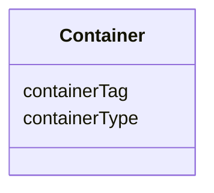

# Class: Container


_"Used to specify the location and relevant attributes of software container image used to produce the dataset."_


URI: [in2pb_dataset:Container](https://w3id.org/ree-gupta/in2pb/in2pb-datasetContainer)





<!-- no inheritance hierarchy -->


## Slots

| Name | Cardinality and Range | Description | Inheritance |
| ---  | --- | --- | --- |
| [containerType](containerType.md) | 0..1 <br/> [String](String.md) | Type of the container | direct |
| [containerTag](containerTag.md) | 0..1 <br/> [String](String.md) | Tag of the container | direct |


## Usages

| used by | used in | type | used |
| ---  | --- | --- | --- |
| [GeneratedBy](GeneratedBy.md) | [container](container.md) | range | [Container](Container.md) |


## Identifier and Mapping Information


### Schema Source


* from schema: https://w3id.org/ree-gupta/in2pb/in2pb-dataset


## Mappings

| Mapping Type | Mapped Value |
| ---  | ---  |
| self | in2pb_dataset:Container |
| native | in2pb_dataset:Container |


## LinkML Source

<!-- TODO: investigate https://stackoverflow.com/questions/37606292/how-to-create-tabbed-code-blocks-in-mkdocs-or-sphinx -->

### Direct

<details>
```yaml
name: Container
description: '"Used to specify the location and relevant attributes of software container
  image used to produce the dataset."'
from_schema: https://w3id.org/ree-gupta/in2pb/in2pb-dataset
slots:
- containerType
- containerTag

```
</details>

### Induced

<details>
```yaml
name: Container
description: '"Used to specify the location and relevant attributes of software container
  image used to produce the dataset."'
from_schema: https://w3id.org/ree-gupta/in2pb/in2pb-dataset
attributes:
  containerType:
    name: containerType
    description: Type of the container.
    from_schema: https://w3id.org/ree-gupta/in2pb/in2pb-dataset
    close_mappings:
    - openminds:type
    - bids:[placeholder]
    rank: 1000
    alias: containerType
    owner: Container
    domain_of:
    - Container
    range: string
  containerTag:
    name: containerTag
    description: Tag of the container.
    from_schema: https://w3id.org/ree-gupta/in2pb/in2pb-dataset
    close_mappings:
    - bids:[placeholder]
    rank: 1000
    alias: containerTag
    owner: Container
    domain_of:
    - Container
    range: string

```
</details>