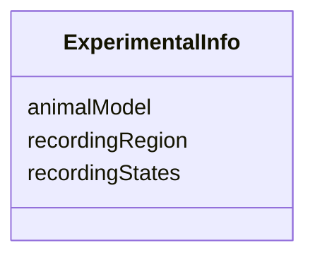

# Class: ExperimentalInfo


_"An overview description of the experiment, the data was recorded from."_


URI: [in2pb_dataset:ExperimentalInfo](https://w3id.org/ree-gupta/in2pb/in2pb-datasetExperimentalInfo)





<!-- no inheritance hierarchy -->


## Slots

| Name | Cardinality and Range | Description | Inheritance |
| ---  | --- | --- | --- |
| [animalModel](animalModel.md) | 0..* <br/> [String](String.md) | Animal model used in the experiment | direct |
| [recordingRegion](recordingRegion.md) | 0..* <br/> [String](String.md) | Region of the brain recorded from | direct |
| [recordingStates](recordingStates.md) | 0..* <br/> [String](String.md) | States of the animal during the recording | direct |


## Usages

| used by | used in | type | used |
| ---  | --- | --- | --- |
| [In2PrimateBrainsDataset](In2PrimateBrainsDataset.md) | [experimentalInfo](experimentalInfo.md) | range | [ExperimentalInfo](ExperimentalInfo.md) |


## Identifier and Mapping Information


### Schema Source


* from schema: https://w3id.org/ree-gupta/in2pb/in2pb-dataset


## Mappings

| Mapping Type | Mapped Value |
| ---  | ---  |
| self | in2pb_dataset:ExperimentalInfo |
| native | in2pb_dataset:ExperimentalInfo |


## LinkML Source

<!-- TODO: investigate https://stackoverflow.com/questions/37606292/how-to-create-tabbed-code-blocks-in-mkdocs-or-sphinx -->

### Direct

<details>
```yaml
name: ExperimentalInfo
description: '"An overview description of the experiment, the data was recorded from."'
from_schema: https://w3id.org/ree-gupta/in2pb/in2pb-dataset
slots:
- animalModel
- recordingRegion
- recordingStates

```
</details>

### Induced

<details>
```yaml
name: ExperimentalInfo
description: '"An overview description of the experiment, the data was recorded from."'
from_schema: https://w3id.org/ree-gupta/in2pb/in2pb-dataset
attributes:
  animalModel:
    name: animalModel
    description: Animal model used in the experiment.
    from_schema: https://w3id.org/ree-gupta/in2pb/in2pb-dataset
    rank: 1000
    multivalued: true
    alias: animalModel
    owner: ExperimentalInfo
    domain_of:
    - ExperimentalInfo
    range: string
  recordingRegion:
    name: recordingRegion
    description: Region of the brain recorded from.
    from_schema: https://w3id.org/ree-gupta/in2pb/in2pb-dataset
    rank: 1000
    multivalued: true
    alias: recordingRegion
    owner: ExperimentalInfo
    domain_of:
    - ExperimentalInfo
    range: string
  recordingStates:
    name: recordingStates
    description: States of the animal during the recording.
    from_schema: https://w3id.org/ree-gupta/in2pb/in2pb-dataset
    rank: 1000
    multivalued: true
    alias: recordingStates
    owner: ExperimentalInfo
    domain_of:
    - ExperimentalInfo
    range: string

```
</details>