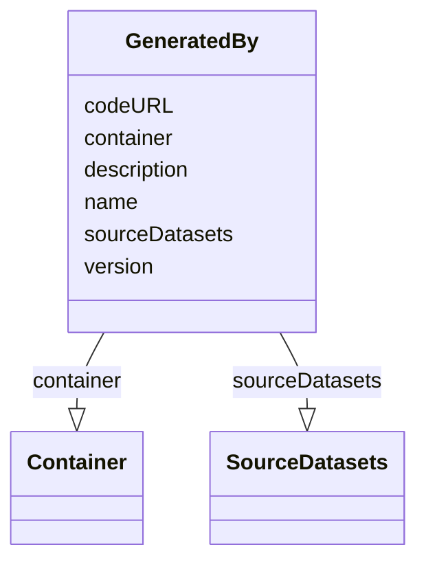

# Class: GeneratedBy


_"List of GeneratedBy objects used to specify the provenance."_


URI: [in2pb_dataset:GeneratedBy](https://w3id.org/ree-gupta/in2pb/in2pb-datasetGeneratedBy)





<!-- no inheritance hierarchy -->


## Slots

| Name | Cardinality and Range | Description | Inheritance |
| ---  | --- | --- | --- |
| [name](name.md) | 0..1 <br/> [String](String.md) | A human-readable name for a thing | direct |
| [version](version.md) | 0..1 <br/> [String](String.md) | Version of the GeneratedBy object | direct |
| [description](description.md) | 0..1 <br/> [String](String.md) | A human-readable description for a thing | direct |
| [codeURL](codeURL.md) | 0..1 <br/> [String](String.md) | URL of the code used to generate the dataset | direct |
| [container](container.md) | 0..1 <br/> [Container](Container.md) | Container object used to specify the location and relevant attributes of soft... | direct |
| [sourceDatasets](sourceDatasets.md) | 0..1 <br/> [SourceDatasets](SourceDatasets.md) | SourceDatasets object used to specify the locations and relevant attributes o... | direct |


## Usages

| used by | used in | type | used |
| ---  | --- | --- | --- |
| [In2PrimateBrainsDataset](In2PrimateBrainsDataset.md) | [generatedBy](generatedBy.md) | range | [GeneratedBy](GeneratedBy.md) |


## Identifier and Mapping Information


### Schema Source


* from schema: https://w3id.org/ree-gupta/in2pb/in2pb-dataset


## Mappings

| Mapping Type | Mapped Value |
| ---  | ---  |
| self | in2pb_dataset:GeneratedBy |
| native | in2pb_dataset:GeneratedBy |


## LinkML Source

<!-- TODO: investigate https://stackoverflow.com/questions/37606292/how-to-create-tabbed-code-blocks-in-mkdocs-or-sphinx -->

### Direct

<details>
```yaml
name: GeneratedBy
description: '"List of GeneratedBy objects used to specify the provenance."'
from_schema: https://w3id.org/ree-gupta/in2pb/in2pb-dataset
slots:
- name
- version
- description
- codeURL
- container
- sourceDatasets

```
</details>

### Induced

<details>
```yaml
name: GeneratedBy
description: '"List of GeneratedBy objects used to specify the provenance."'
from_schema: https://w3id.org/ree-gupta/in2pb/in2pb-dataset
attributes:
  name:
    name: name
    description: A human-readable name for a thing
    from_schema: https://w3id.org/ree-gupta/in2pb/in2pb-dataset
    rank: 1000
    slot_uri: schema:name
    alias: name
    owner: GeneratedBy
    domain_of:
    - NamedThing
    - GeneratedBy
    range: string
  version:
    name: version
    description: Version of the GeneratedBy object.
    from_schema: https://w3id.org/ree-gupta/in2pb/in2pb-dataset
    close_mappings:
    - openminds_core:[placeholder]
    - bids:[placeholder]
    rank: 1000
    alias: version
    owner: GeneratedBy
    domain_of:
    - GeneratedBy
    range: string
  description:
    name: description
    description: A human-readable description for a thing
    from_schema: https://w3id.org/ree-gupta/in2pb/in2pb-dataset
    rank: 1000
    slot_uri: schema:description
    alias: description
    owner: GeneratedBy
    domain_of:
    - NamedThing
    - GeneratedBy
    range: string
  codeURL:
    name: codeURL
    description: URL of the code used to generate the dataset.
    from_schema: https://w3id.org/ree-gupta/in2pb/in2pb-dataset
    close_mappings:
    - openminds_core:uRL
    - bids:[placeholder]
    rank: 1000
    alias: codeURL
    owner: GeneratedBy
    domain_of:
    - GeneratedBy
    range: string
  container:
    name: container
    description: Container object used to specify the location and relevant attributes
      of software container image used to produce the dataset.
    from_schema: https://w3id.org/ree-gupta/in2pb/in2pb-dataset
    close_mappings:
    - bids:[placeholder]
    broad_mappings:
    - openminds_core:software
    rank: 1000
    alias: container
    owner: GeneratedBy
    domain_of:
    - GeneratedBy
    range: Container
  sourceDatasets:
    name: sourceDatasets
    description: SourceDatasets object used to specify the locations and relevant
      attributes of all source datasets.
    from_schema: https://w3id.org/ree-gupta/in2pb/in2pb-dataset
    close_mappings:
    - bids:[placeholder]
    rank: 1000
    alias: sourceDatasets
    owner: GeneratedBy
    domain_of:
    - GeneratedBy
    range: SourceDatasets

```
</details>