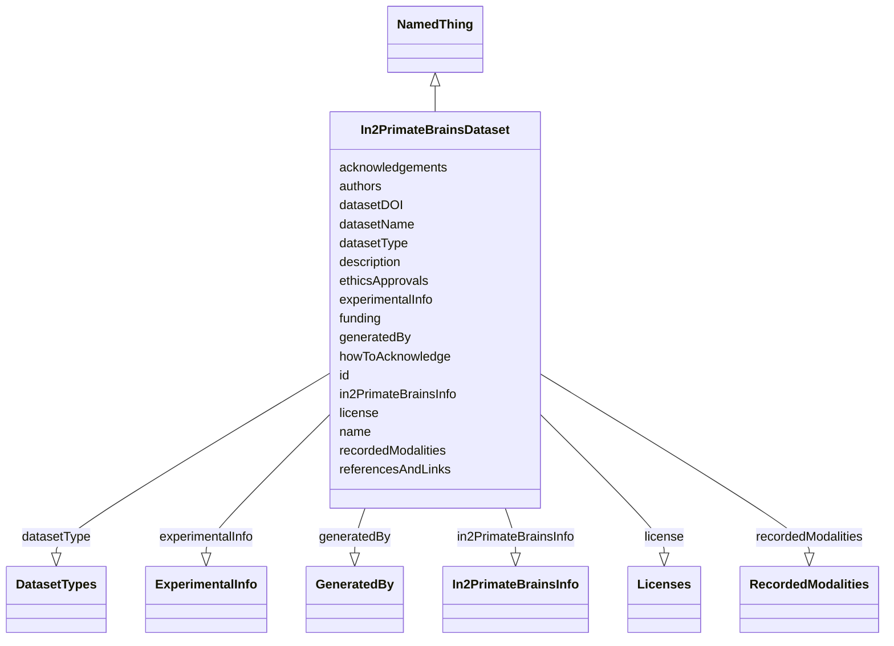

# Class: In2PrimateBrainsDataset


_"A complete dataset generated by an In2PrimateBrains project."_


URI: [in2pb_dataset:In2PrimateBrainsDataset](https://w3id.org/ree-gupta/in2pb/in2pb-datasetIn2PrimateBrainsDataset)





## Inheritance
* [NamedThing](NamedThing.md)
    * **In2PrimateBrainsDataset**


## Slots

| Name | Cardinality and Range | Description | Inheritance |
| ---  | --- | --- | --- |
| [datasetName](datasetName.md) | 1..1 <br/> [String](String.md) | "The full name of the dataset | direct |
| [datasetType](datasetType.md) | 1..* <br/> [DatasetTypes](DatasetTypes.md) | Type of the dataset | direct |
| [license](license.md) | 1..1 <br/> [Licenses](Licenses.md) | License for the dataset | direct |
| [authors](authors.md) | 0..* <br/> [String](String.md) | List of authors who contributed to the dataset | direct |
| [acknowledgements](acknowledgements.md) | 0..1 <br/> [String](String.md) | Text acknowledging contributions of individuals or institutions beyond those ... | direct |
| [howToAcknowledge](howToAcknowledge.md) | 0..1 <br/> [String](String.md) | Text or reference describing how to acknowledge this dataset | direct |
| [funding](funding.md) | 0..* <br/> [String](String.md) | List of sources of funding (grant numbers) | direct |
| [ethicsApprovals](ethicsApprovals.md) | 0..* <br/> [String](String.md) | List of ethics approvals | direct |
| [referencesAndLinks](referencesAndLinks.md) | 0..* <br/> [String](String.md) | List of references and links | direct |
| [datasetDOI](datasetDOI.md) | 0..1 <br/> [String](String.md) | DOI of the dataset | direct |
| [generatedBy](generatedBy.md) | 0..* <br/> [GeneratedBy](GeneratedBy.md) | List of GeneratedBy objects used to specify the provenance | direct |
| [experimentalInfo](experimentalInfo.md) | 0..1 <br/> [ExperimentalInfo](ExperimentalInfo.md) | Concise information used to specify an overview description of the experiment... | direct |
| [recordedModalities](recordedModalities.md) | 0..1 <br/> [RecordedModalities](RecordedModalities.md) | Concise information used to specify an overview description of the recording ... | direct |
| [in2PrimateBrainsInfo](in2PrimateBrainsInfo.md) | 0..1 <br/> [In2PrimateBrainsInfo](In2PrimateBrainsInfo.md) | List of In2PrimateBrains entities that contributed to this dataset | direct |
| [id](id.md) | 1..1 <br/> [Uriorcurie](Uriorcurie.md) | A unique identifier for a thing | [NamedThing](NamedThing.md) |
| [name](name.md) | 0..1 <br/> [String](String.md) | A human-readable name for a thing | [NamedThing](NamedThing.md) |
| [description](description.md) | 0..1 <br/> [String](String.md) | A human-readable description for a thing | [NamedThing](NamedThing.md) |


## Identifier and Mapping Information


### Schema Source


* from schema: https://w3id.org/ree-gupta/in2pb/in2pb-dataset


## Mappings

| Mapping Type | Mapped Value |
| ---  | ---  |
| self | in2pb_dataset:In2PrimateBrainsDataset |
| native | in2pb_dataset:In2PrimateBrainsDataset |


## LinkML Source

<!-- TODO: investigate https://stackoverflow.com/questions/37606292/how-to-create-tabbed-code-blocks-in-mkdocs-or-sphinx -->

### Direct

<details>
```yaml
name: In2PrimateBrainsDataset
description: '"A complete dataset generated by an In2PrimateBrains project."'
from_schema: https://w3id.org/ree-gupta/in2pb/in2pb-dataset
is_a: NamedThing
slots:
- datasetName
- datasetType
- license
- authors
- acknowledgements
- howToAcknowledge
- funding
- ethicsApprovals
- referencesAndLinks
- datasetDOI
- generatedBy
- experimentalInfo
- recordedModalities
- in2PrimateBrainsInfo

```
</details>

### Induced

<details>
```yaml
name: In2PrimateBrainsDataset
description: '"A complete dataset generated by an In2PrimateBrains project."'
from_schema: https://w3id.org/ree-gupta/in2pb/in2pb-dataset
is_a: NamedThing
attributes:
  datasetName:
    name: datasetName
    description: '"The full name of the dataset."'
    from_schema: https://w3id.org/ree-gupta/in2pb/in2pb-dataset
    close_mappings:
    - openminds:fullName
    - bids:Name(metadata)
    broad_mappings:
    - schema:name
    rank: 1000
    alias: datasetName
    owner: In2PrimateBrainsDataset
    domain_of:
    - In2PrimateBrainsDataset
    range: string
    required: true
  datasetType:
    name: datasetType
    description: Type of the dataset.
    from_schema: https://w3id.org/ree-gupta/in2pb/in2pb-dataset
    close_mappings:
    - openminds:type
    - bids:DatasetType(metadata)
    rank: 1000
    multivalued: true
    alias: datasetType
    owner: In2PrimateBrainsDataset
    domain_of:
    - In2PrimateBrainsDataset
    range: DatasetTypes
    required: true
  license:
    name: license
    description: License for the dataset
    from_schema: https://w3id.org/ree-gupta/in2pb/in2pb-dataset
    close_mappings:
    - openminds_core:license
    - bids:License(metadata)
    rank: 1000
    alias: license
    owner: In2PrimateBrainsDataset
    domain_of:
    - In2PrimateBrainsDataset
    range: Licenses
    required: true
  authors:
    name: authors
    description: List of authors who contributed to the dataset
    from_schema: https://w3id.org/ree-gupta/in2pb/in2pb-dataset
    close_mappings:
    - openminds:author
    - bids:Authors(metadata)
    rank: 1000
    multivalued: true
    alias: authors
    owner: In2PrimateBrainsDataset
    domain_of:
    - In2PrimateBrainsDataset
    range: string
  acknowledgements:
    name: acknowledgements
    description: Text acknowledging contributions of individuals or institutions beyond
      those listed in Authors or Funding.
    from_schema: https://w3id.org/ree-gupta/in2pb/in2pb-dataset
    close_mappings:
    - bids:Acknowledgements(metadata)
    rank: 1000
    multivalued: false
    alias: acknowledgements
    owner: In2PrimateBrainsDataset
    domain_of:
    - In2PrimateBrainsDataset
    range: string
  howToAcknowledge:
    name: howToAcknowledge
    description: Text or reference describing how to acknowledge this dataset
    from_schema: https://w3id.org/ree-gupta/in2pb/in2pb-dataset
    close_mappings:
    - openminds:howToCite
    - bids:HowToAcknowledge(metadata)
    rank: 1000
    alias: howToAcknowledge
    owner: In2PrimateBrainsDataset
    domain_of:
    - In2PrimateBrainsDataset
    range: string
  funding:
    name: funding
    description: List of sources of funding (grant numbers)
    from_schema: https://w3id.org/ree-gupta/in2pb/in2pb-dataset
    close_mappings:
    - openminds_core:funding
    - bids:Funding(metadata)
    rank: 1000
    multivalued: true
    alias: funding
    owner: In2PrimateBrainsDataset
    domain_of:
    - In2PrimateBrainsDataset
    range: string
  ethicsApprovals:
    name: ethicsApprovals
    description: List of ethics approvals
    from_schema: https://w3id.org/ree-gupta/in2pb/in2pb-dataset
    close_mappings:
    - openminds_core:ethicsAssessment
    - bids:EthicsApprovals(metadata)
    rank: 1000
    multivalued: true
    alias: ethicsApprovals
    owner: In2PrimateBrainsDataset
    domain_of:
    - In2PrimateBrainsDataset
    range: string
  referencesAndLinks:
    name: referencesAndLinks
    description: List of references and links
    from_schema: https://w3id.org/ree-gupta/in2pb/in2pb-dataset
    close_mappings:
    - openminds_core:uRL
    - bids:ReferencesAndLinks(metadata)
    rank: 1000
    multivalued: true
    alias: referencesAndLinks
    owner: In2PrimateBrainsDataset
    domain_of:
    - In2PrimateBrainsDataset
    range: string
  datasetDOI:
    name: datasetDOI
    description: DOI of the dataset
    from_schema: https://w3id.org/ree-gupta/in2pb/in2pb-dataset
    close_mappings:
    - openminds_core:dOI
    - bids:DatasetDOI(metadata)
    rank: 1000
    alias: datasetDOI
    owner: In2PrimateBrainsDataset
    domain_of:
    - In2PrimateBrainsDataset
    range: string
  generatedBy:
    name: generatedBy
    description: List of GeneratedBy objects used to specify the provenance.
    from_schema: https://w3id.org/ree-gupta/in2pb/in2pb-dataset
    close_mappings:
    - bids:GeneratedBy(metadata)
    broad_mappings:
    - openminds_core:dataset
    rank: 1000
    multivalued: true
    alias: generatedBy
    owner: In2PrimateBrainsDataset
    domain_of:
    - In2PrimateBrainsDataset
    range: GeneratedBy
  experimentalInfo:
    name: experimentalInfo
    description: Concise information used to specify an overview description of the
      experiment, the data was recorded from.
    from_schema: https://w3id.org/ree-gupta/in2pb/in2pb-dataset
    rank: 1000
    alias: experimentalInfo
    owner: In2PrimateBrainsDataset
    domain_of:
    - In2PrimateBrainsDataset
    range: ExperimentalInfo
  recordedModalities:
    name: recordedModalities
    description: Concise information used to specify an overview description of the
      recording modalities present in the data.
    from_schema: https://w3id.org/ree-gupta/in2pb/in2pb-dataset
    rank: 1000
    alias: recordedModalities
    owner: In2PrimateBrainsDataset
    domain_of:
    - In2PrimateBrainsDataset
    range: RecordedModalities
  in2PrimateBrainsInfo:
    name: in2PrimateBrainsInfo
    description: List of In2PrimateBrains entities that contributed to this dataset.
    from_schema: https://w3id.org/ree-gupta/in2pb/in2pb-dataset
    rank: 1000
    alias: in2PrimateBrainsInfo
    owner: In2PrimateBrainsDataset
    domain_of:
    - In2PrimateBrainsDataset
    range: In2PrimateBrainsInfo
  id:
    name: id
    description: A unique identifier for a thing
    from_schema: https://w3id.org/ree-gupta/in2pb/in2pb-dataset
    rank: 1000
    slot_uri: schema:identifier
    identifier: true
    alias: id
    owner: In2PrimateBrainsDataset
    domain_of:
    - NamedThing
    range: uriorcurie
    required: true
  name:
    name: name
    description: A human-readable name for a thing
    from_schema: https://w3id.org/ree-gupta/in2pb/in2pb-dataset
    rank: 1000
    slot_uri: schema:name
    alias: name
    owner: In2PrimateBrainsDataset
    domain_of:
    - NamedThing
    - GeneratedBy
    range: string
  description:
    name: description
    description: A human-readable description for a thing
    from_schema: https://w3id.org/ree-gupta/in2pb/in2pb-dataset
    rank: 1000
    slot_uri: schema:description
    alias: description
    owner: In2PrimateBrainsDataset
    domain_of:
    - NamedThing
    - GeneratedBy
    range: string

```
</details>