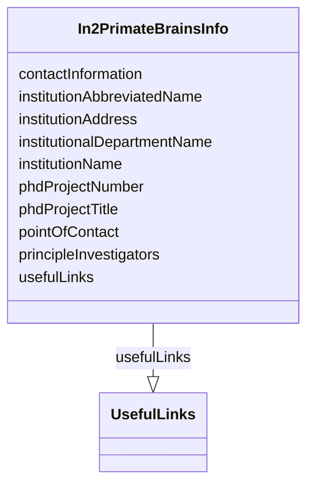

# Class: In2PrimateBrainsInfo


_"List of In2PrimateBrains entities that contributed to this dataset."_


URI: [in2pb_dataset:In2PrimateBrainsInfo](https://w3id.org/ree-gupta/in2pb/in2pb-datasetIn2PrimateBrainsInfo)





<!-- no inheritance hierarchy -->


## Slots

| Name | Cardinality and Range | Description | Inheritance |
| ---  | --- | --- | --- |
| [phdProjectNumber](phdProjectNumber.md) | 0..1 <br/> [String](String.md) | PhD project associated with In2PB entity | direct |
| [phdProjectTitle](phdProjectTitle.md) | 0..1 <br/> [String](String.md) | The proposed title of the PhD project in the grant agreement for the describe... | direct |
| [institutionName](institutionName.md) | 0..1 <br/> [String](String.md) | Name of the associated In2PB entity | direct |
| [institutionAbbreviatedName](institutionAbbreviatedName.md) | 0..1 <br/> [String](String.md) | Abbreviated name of the associated In2PB entity | direct |
| [institutionAddress](institutionAddress.md) | 0..1 <br/> [String](String.md) | Address of the associated In2PB entity | direct |
| [institutionalDepartmentName](institutionalDepartmentName.md) | 0..1 <br/> [String](String.md) | The department in the institution with which the In2PB entity is associated | direct |
| [principleInvestigators](principleInvestigators.md) | 0..* <br/> [String](String.md) | List of principle investigators associated with the In2PB entity | direct |
| [pointOfContact](pointOfContact.md) | 0..1 <br/> [String](String.md) | The name of the person for the point of contact | direct |
| [contactInformation](contactInformation.md) | 0..1 <br/> [String](String.md) | The contact information of the person for the point of contact | direct |
| [usefulLinks](usefulLinks.md) | 0..* <br/> [UsefulLinks](UsefulLinks.md) | Optional list of links for adding more information | direct |


## Usages

| used by | used in | type | used |
| ---  | --- | --- | --- |
| [In2PrimateBrainsDataset](In2PrimateBrainsDataset.md) | [in2PrimateBrainsInfo](in2PrimateBrainsInfo.md) | range | [In2PrimateBrainsInfo](In2PrimateBrainsInfo.md) |


## Identifier and Mapping Information


### Schema Source


* from schema: https://w3id.org/ree-gupta/in2pb/in2pb-dataset


## Mappings

| Mapping Type | Mapped Value |
| ---  | ---  |
| self | in2pb_dataset:In2PrimateBrainsInfo |
| native | in2pb_dataset:In2PrimateBrainsInfo |


## LinkML Source

<!-- TODO: investigate https://stackoverflow.com/questions/37606292/how-to-create-tabbed-code-blocks-in-mkdocs-or-sphinx -->

### Direct

<details>
```yaml
name: In2PrimateBrainsInfo
description: '"List of In2PrimateBrains entities that contributed to this dataset."'
from_schema: https://w3id.org/ree-gupta/in2pb/in2pb-dataset
slots:
- phdProjectNumber
- phdProjectTitle
- institutionName
- institutionAbbreviatedName
- institutionAddress
- institutionalDepartmentName
- principleInvestigators
- pointOfContact
- contactInformation
- usefulLinks

```
</details>

### Induced

<details>
```yaml
name: In2PrimateBrainsInfo
description: '"List of In2PrimateBrains entities that contributed to this dataset."'
from_schema: https://w3id.org/ree-gupta/in2pb/in2pb-dataset
attributes:
  phdProjectNumber:
    name: phdProjectNumber
    description: PhD project associated with In2PB entity. To be left empty for partner
      entity.
    from_schema: https://w3id.org/ree-gupta/in2pb/in2pb-dataset
    rank: 1000
    alias: phdProjectNumber
    owner: In2PrimateBrainsInfo
    domain_of:
    - In2PrimateBrainsInfo
    range: string
  phdProjectTitle:
    name: phdProjectTitle
    description: The proposed title of the PhD project in the grant agreement for
      the described entity. To be left empty for partner entity.
    from_schema: https://w3id.org/ree-gupta/in2pb/in2pb-dataset
    rank: 1000
    alias: phdProjectTitle
    owner: In2PrimateBrainsInfo
    domain_of:
    - In2PrimateBrainsInfo
    range: string
  institutionName:
    name: institutionName
    description: Name of the associated In2PB entity.
    from_schema: https://w3id.org/ree-gupta/in2pb/in2pb-dataset
    rank: 1000
    alias: institutionName
    owner: In2PrimateBrainsInfo
    domain_of:
    - In2PrimateBrainsInfo
    range: string
  institutionAbbreviatedName:
    name: institutionAbbreviatedName
    description: Abbreviated name of the associated In2PB entity.
    from_schema: https://w3id.org/ree-gupta/in2pb/in2pb-dataset
    rank: 1000
    alias: institutionAbbreviatedName
    owner: In2PrimateBrainsInfo
    domain_of:
    - In2PrimateBrainsInfo
    range: string
  institutionAddress:
    name: institutionAddress
    description: Address of the associated In2PB entity.
    from_schema: https://w3id.org/ree-gupta/in2pb/in2pb-dataset
    rank: 1000
    alias: institutionAddress
    owner: In2PrimateBrainsInfo
    domain_of:
    - In2PrimateBrainsInfo
    range: string
  institutionalDepartmentName:
    name: institutionalDepartmentName
    description: The department in the institution with which the In2PB entity is
      associated.
    from_schema: https://w3id.org/ree-gupta/in2pb/in2pb-dataset
    rank: 1000
    alias: institutionalDepartmentName
    owner: In2PrimateBrainsInfo
    domain_of:
    - In2PrimateBrainsInfo
    range: string
  principleInvestigators:
    name: principleInvestigators
    description: List of principle investigators associated with the In2PB entity.
    from_schema: https://w3id.org/ree-gupta/in2pb/in2pb-dataset
    rank: 1000
    multivalued: true
    alias: principleInvestigators
    owner: In2PrimateBrainsInfo
    domain_of:
    - In2PrimateBrainsInfo
    range: string
  pointOfContact:
    name: pointOfContact
    description: The name of the person for the point of contact.
    from_schema: https://w3id.org/ree-gupta/in2pb/in2pb-dataset
    rank: 1000
    alias: pointOfContact
    owner: In2PrimateBrainsInfo
    domain_of:
    - In2PrimateBrainsInfo
    range: string
  contactInformation:
    name: contactInformation
    description: The contact information of the person for the point of contact.
    from_schema: https://w3id.org/ree-gupta/in2pb/in2pb-dataset
    rank: 1000
    alias: contactInformation
    owner: In2PrimateBrainsInfo
    domain_of:
    - In2PrimateBrainsInfo
    range: string
  usefulLinks:
    name: usefulLinks
    description: Optional list of links for adding more information.
    from_schema: https://w3id.org/ree-gupta/in2pb/in2pb-dataset
    rank: 1000
    multivalued: true
    alias: usefulLinks
    owner: In2PrimateBrainsInfo
    domain_of:
    - In2PrimateBrainsInfo
    range: UsefulLinks

```
</details>