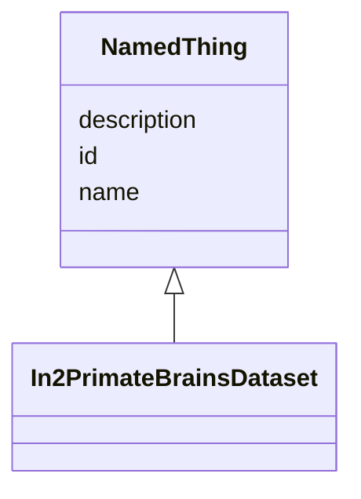

# Class: NamedThing


_A generic grouping for any identifiable entity_


URI: [schema:Thing](http://schema.org/Thing)





## Inheritance
* **NamedThing**
    * [In2PrimateBrainsDataset](In2PrimateBrainsDataset.md)


## Slots

| Name | Cardinality and Range | Description | Inheritance |
| ---  | --- | --- | --- |
| [id](id.md) | 1..1 <br/> [Uriorcurie](Uriorcurie.md) | A unique identifier for a thing | direct |
| [name](name.md) | 0..1 <br/> [String](String.md) | A human-readable name for a thing | direct |
| [description](description.md) | 0..1 <br/> [String](String.md) | A human-readable description for a thing | direct |


## Identifier and Mapping Information


### Schema Source


* from schema: https://w3id.org/ree-gupta/in2pb/in2pb-dataset


## Mappings

| Mapping Type | Mapped Value |
| ---  | ---  |
| self | schema:Thing |
| native | in2pb_dataset:NamedThing |


## LinkML Source

<!-- TODO: investigate https://stackoverflow.com/questions/37606292/how-to-create-tabbed-code-blocks-in-mkdocs-or-sphinx -->

### Direct

<details>
```yaml
name: NamedThing
description: A generic grouping for any identifiable entity
from_schema: https://w3id.org/ree-gupta/in2pb/in2pb-dataset
slots:
- id
- name
- description
class_uri: schema:Thing

```
</details>

### Induced

<details>
```yaml
name: NamedThing
description: A generic grouping for any identifiable entity
from_schema: https://w3id.org/ree-gupta/in2pb/in2pb-dataset
attributes:
  id:
    name: id
    description: A unique identifier for a thing
    from_schema: https://w3id.org/ree-gupta/in2pb/in2pb-dataset
    rank: 1000
    slot_uri: schema:identifier
    identifier: true
    alias: id
    owner: NamedThing
    domain_of:
    - NamedThing
    range: uriorcurie
  name:
    name: name
    description: A human-readable name for a thing
    from_schema: https://w3id.org/ree-gupta/in2pb/in2pb-dataset
    rank: 1000
    slot_uri: schema:name
    alias: name
    owner: NamedThing
    domain_of:
    - NamedThing
    - GeneratedBy
    range: string
  description:
    name: description
    description: A human-readable description for a thing
    from_schema: https://w3id.org/ree-gupta/in2pb/in2pb-dataset
    rank: 1000
    slot_uri: schema:description
    alias: description
    owner: NamedThing
    domain_of:
    - NamedThing
    - GeneratedBy
    range: string
class_uri: schema:Thing

```
</details>