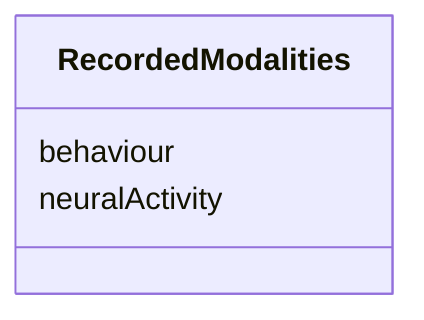

# Class: RecordedModalities


_"An overview description of the recording modalities present in the data."_


URI: [in2pb_dataset:RecordedModalities](https://w3id.org/ree-gupta/in2pb/in2pb-datasetRecordedModalities)





<!-- no inheritance hierarchy -->


## Slots

| Name | Cardinality and Range | Description | Inheritance |
| ---  | --- | --- | --- |
| [neuralActivity](neuralActivity.md) | 0..* <br/> [String](String.md) | Short text information on neural activity recorded | direct |
| [behaviour](behaviour.md) | 0..* <br/> [String](String.md) | Short text information on behaviour recorded | direct |


## Usages

| used by | used in | type | used |
| ---  | --- | --- | --- |
| [In2PrimateBrainsDataset](In2PrimateBrainsDataset.md) | [recordedModalities](recordedModalities.md) | range | [RecordedModalities](RecordedModalities.md) |


## Identifier and Mapping Information


### Schema Source


* from schema: https://w3id.org/ree-gupta/in2pb/in2pb-dataset


## Mappings

| Mapping Type | Mapped Value |
| ---  | ---  |
| self | in2pb_dataset:RecordedModalities |
| native | in2pb_dataset:RecordedModalities |


## LinkML Source

<!-- TODO: investigate https://stackoverflow.com/questions/37606292/how-to-create-tabbed-code-blocks-in-mkdocs-or-sphinx -->

### Direct

<details>
```yaml
name: RecordedModalities
description: '"An overview description of the recording modalities present in the
  data."'
from_schema: https://w3id.org/ree-gupta/in2pb/in2pb-dataset
slots:
- neuralActivity
- behaviour

```
</details>

### Induced

<details>
```yaml
name: RecordedModalities
description: '"An overview description of the recording modalities present in the
  data."'
from_schema: https://w3id.org/ree-gupta/in2pb/in2pb-dataset
attributes:
  neuralActivity:
    name: neuralActivity
    description: Short text information on neural activity recorded.
    from_schema: https://w3id.org/ree-gupta/in2pb/in2pb-dataset
    rank: 1000
    multivalued: true
    alias: neuralActivity
    owner: RecordedModalities
    domain_of:
    - RecordedModalities
    range: string
  behaviour:
    name: behaviour
    description: Short text information on behaviour recorded.
    from_schema: https://w3id.org/ree-gupta/in2pb/in2pb-dataset
    rank: 1000
    multivalued: true
    alias: behaviour
    owner: RecordedModalities
    domain_of:
    - RecordedModalities
    range: string

```
</details>