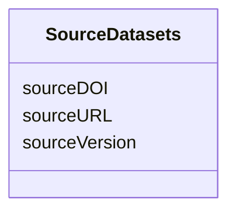

# Class: SourceDatasets


_"Used to specify the locations and relevant attributes of all source datasets."_


URI: [in2pb_dataset:SourceDatasets](https://w3id.org/ree-gupta/in2pb/in2pb-datasetSourceDatasets)





<!-- no inheritance hierarchy -->


## Slots

| Name | Cardinality and Range | Description | Inheritance |
| ---  | --- | --- | --- |
| [sourceURL](sourceURL.md) | 0..1 <br/> [String](String.md) | URL of the source | direct |
| [sourceDOI](sourceDOI.md) | 0..1 <br/> [String](String.md) | DOI of the source | direct |
| [sourceVersion](sourceVersion.md) | 0..1 <br/> [String](String.md) | Version of the source | direct |


## Usages

| used by | used in | type | used |
| ---  | --- | --- | --- |
| [GeneratedBy](GeneratedBy.md) | [sourceDatasets](sourceDatasets.md) | range | [SourceDatasets](SourceDatasets.md) |


## Identifier and Mapping Information


### Schema Source


* from schema: https://w3id.org/ree-gupta/in2pb/in2pb-dataset


## Mappings

| Mapping Type | Mapped Value |
| ---  | ---  |
| self | in2pb_dataset:SourceDatasets |
| native | in2pb_dataset:SourceDatasets |


## LinkML Source

<!-- TODO: investigate https://stackoverflow.com/questions/37606292/how-to-create-tabbed-code-blocks-in-mkdocs-or-sphinx -->

### Direct

<details>
```yaml
name: SourceDatasets
description: '"Used to specify the locations and relevant attributes of all source
  datasets."'
from_schema: https://w3id.org/ree-gupta/in2pb/in2pb-dataset
slots:
- sourceURL
- sourceDOI
- sourceVersion

```
</details>

### Induced

<details>
```yaml
name: SourceDatasets
description: '"Used to specify the locations and relevant attributes of all source
  datasets."'
from_schema: https://w3id.org/ree-gupta/in2pb/in2pb-dataset
attributes:
  sourceURL:
    name: sourceURL
    description: URL of the source.
    from_schema: https://w3id.org/ree-gupta/in2pb/in2pb-dataset
    close_mappings:
    - openminds_core:uRL
    - bids:[placeholder]
    rank: 1000
    alias: sourceURL
    owner: SourceDatasets
    domain_of:
    - SourceDatasets
    range: string
  sourceDOI:
    name: sourceDOI
    description: DOI of the source.
    from_schema: https://w3id.org/ree-gupta/in2pb/in2pb-dataset
    close_mappings:
    - openminds_core:dOI
    - bids:[placeholder]
    rank: 1000
    alias: sourceDOI
    owner: SourceDatasets
    domain_of:
    - SourceDatasets
    range: string
  sourceVersion:
    name: sourceVersion
    description: Version of the source.
    from_schema: https://w3id.org/ree-gupta/in2pb/in2pb-dataset
    close_mappings:
    - bids:[placeholder]
    broad_mappings:
    - openminds_core:softwareVersion
    rank: 1000
    alias: sourceVersion
    owner: SourceDatasets
    domain_of:
    - SourceDatasets
    range: string

```
</details>