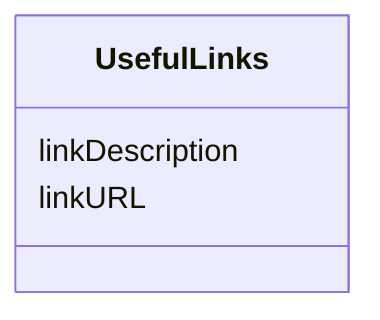

# Class: UsefulLinks


_"Optional list of links for adding more information."_


URI: [in2pb_dataset:UsefulLinks](https://w3id.org/ree-gupta/in2pb/in2pb-datasetUsefulLinks)





<!-- no inheritance hierarchy -->


## Slots

| Name | Cardinality and Range | Description | Inheritance |
| ---  | --- | --- | --- |
| [linkURL](linkURL.md) | 0..1 <br/> [String](String.md) | URL of the link | direct |
| [linkDescription](linkDescription.md) | 0..1 <br/> [String](String.md) | Description of the link | direct |


## Usages

| used by | used in | type | used |
| ---  | --- | --- | --- |
| [In2PrimateBrainsInfo](In2PrimateBrainsInfo.md) | [usefulLinks](usefulLinks.md) | range | [UsefulLinks](UsefulLinks.md) |


## Identifier and Mapping Information


### Schema Source


* from schema: https://w3id.org/ree-gupta/in2pb/in2pb-dataset


## Mappings

| Mapping Type | Mapped Value |
| ---  | ---  |
| self | in2pb_dataset:UsefulLinks |
| native | in2pb_dataset:UsefulLinks |


## LinkML Source

<!-- TODO: investigate https://stackoverflow.com/questions/37606292/how-to-create-tabbed-code-blocks-in-mkdocs-or-sphinx -->

### Direct

<details>
```yaml
name: UsefulLinks
description: '"Optional list of links for adding more information."'
from_schema: https://w3id.org/ree-gupta/in2pb/in2pb-dataset
slots:
- linkURL
- linkDescription

```
</details>

### Induced

<details>
```yaml
name: UsefulLinks
description: '"Optional list of links for adding more information."'
from_schema: https://w3id.org/ree-gupta/in2pb/in2pb-dataset
attributes:
  linkURL:
    name: linkURL
    description: URL of the link.
    from_schema: https://w3id.org/ree-gupta/in2pb/in2pb-dataset
    rank: 1000
    alias: linkURL
    owner: UsefulLinks
    domain_of:
    - UsefulLinks
    range: string
  linkDescription:
    name: linkDescription
    description: Description of the link.
    from_schema: https://w3id.org/ree-gupta/in2pb/in2pb-dataset
    rank: 1000
    alias: linkDescription
    owner: UsefulLinks
    domain_of:
    - UsefulLinks
    range: string

```
</details>