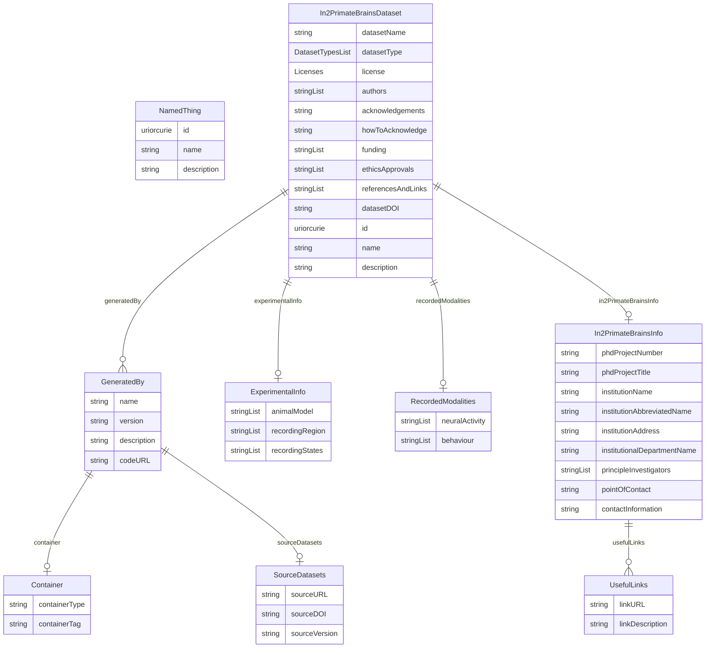

## LinkML schema for In2PB data and metadata

This repository contains the LinkML schema for the In2PB data and metadata.

```mermaid
erDiagram
NamedThing {
    uriorcurie id  
    string name  
    string description  
}
In2PrimateBrainsDataset {
    string datasetName  
    DatasetTypesList datasetType  
    Licenses license  
    stringList authors  
    string acknowledgements  
    string howToAcknowledge  
    stringList funding  
    stringList ethicsApprovals  
    stringList referencesAndLinks  
    string datasetDOI  
    uriorcurie id  
    string name  
    string description  
}
GeneratedBy {
    string name  
    string version  
    string description  
    string codeURL  
}
Container {
    string containerType  
    string containerTag  
}
SourceDatasets {
    string sourceURL  
    string sourceDOI  
    string sourceVersion  
}
ExperimentalInfo {
    stringList animalModel  
    stringList recordingRegion  
    stringList recordingStates  
}
RecordedModalities {
    stringList neuralActivity  
    stringList behaviour  
}
In2PrimateBrainsInfo {
    string phdProjectNumber  
    string phdProjectTitle  
    string institutionName  
    string institutionAbbreviatedName  
    string institutionAddress  
    string institutionalDepartmentName  
    stringList principleInvestigators  
    string pointOfContact  
    string contactInformation  
}
UsefulLinks {
    string linkURL  
    string linkDescription  
}

In2PrimateBrainsDataset ||--}o GeneratedBy : "generatedBy"
In2PrimateBrainsDataset ||--|o ExperimentalInfo : "experimentalInfo"
In2PrimateBrainsDataset ||--|o RecordedModalities : "recordedModalities"
In2PrimateBrainsDataset ||--|o In2PrimateBrainsInfo : "in2PrimateBrainsInfo"
GeneratedBy ||--|o Container : "container"
GeneratedBy ||--|o SourceDatasets : "sourceDatasets"
In2PrimateBrainsInfo ||--}o UsefulLinks : "usefulLinks"

```

